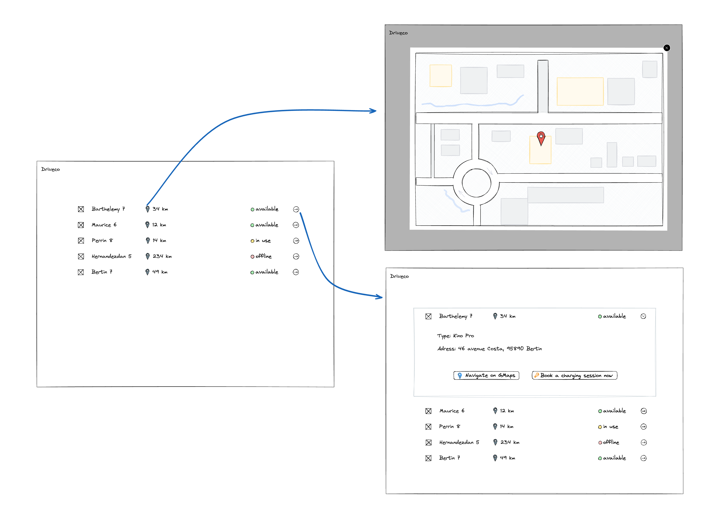

# Specifications

[Main specifications document](./specifications-document.pdf)

The app can be resumed in one main list of data (chargebox informations, 25 items).

This list is defined by columns in this order:

1. an icon, defined by data from `/charge-boxes` using `type`

   Icon url can be found from `/parameters.json` using `charbebox_type.{type}.icon`.

2. a name, defined by data from `/charge-boxes` using `name`

3. a position, defined by data from `/charge-boxes` using `location`

   Only an icon with the distance in km is showed, but on click a modal opens with a map centered the correct location (view 2).

4. a status, defined by data from `/charge-boxes` using `status`

   Translation can be found from `/parameters.json` using `translations.{language}.chargebox.status.{status}`.
   A colored chip should also be used: green for available, yellow for in-use, red for offline.

5. a button to "see more"

   This button switchs from view 1 to view 2 (with details showed).
   Note that a card is now visible.

   6. type of the chargebox, defined by data from `/charge-boxes` using `type`

      Type name can be found from `/parameters.json` using `charbebox_type.{type}.name`.

   7. address of the chargebox, defined by data from `/charge-boxes` using `address`, `city` & `zipcode`

   8. a button "Navigate on GMaps" redirecting to GMaps using location

      Translation can be found from `/parameters.json` using `translations.{language}.cta.navigate_gmap`.

   9. a button "Book a charging session now", no action

      Translation can be found from `/parameters.json` using `translations.{language}.cta.booking`.
